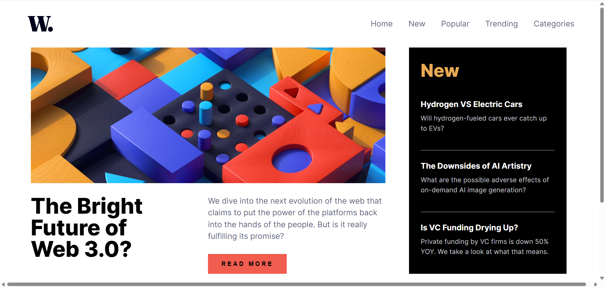
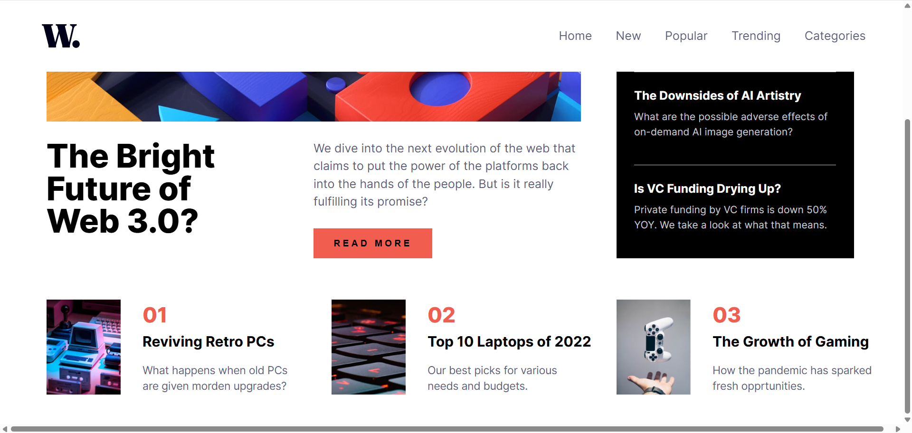
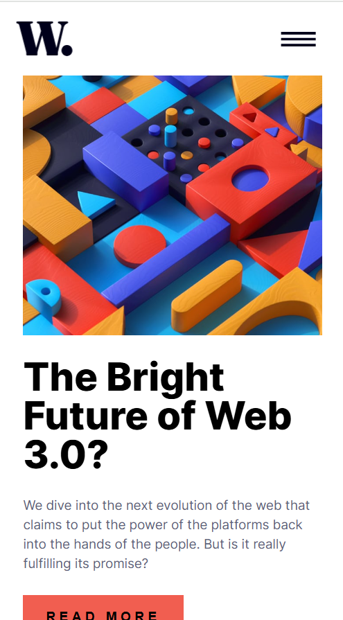
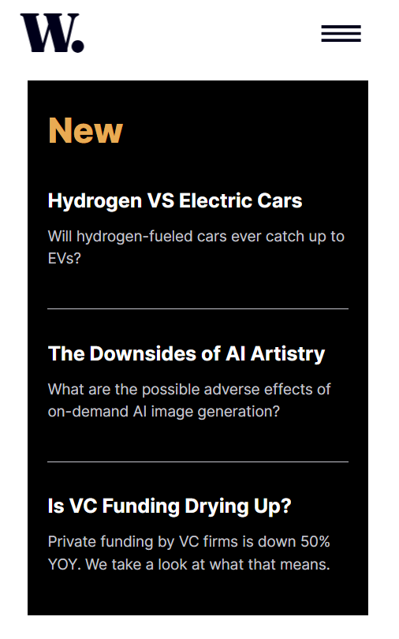
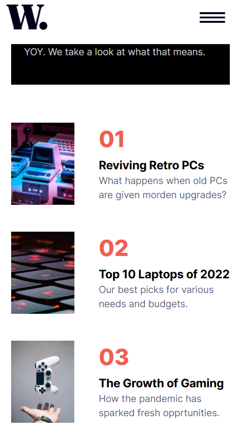
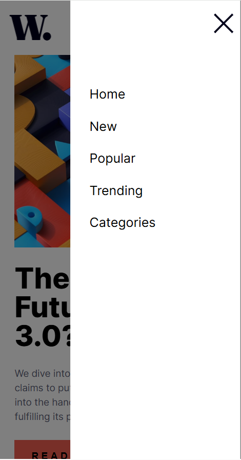

# Frontend Mentor - News homepage solution

This is a solution to the [News homepage challenge on Frontend Mentor](https://www.frontendmentor.io/challenges/news-homepage-H6SWTa1MFl).

## Table of contents

- [Overview](#overview)
  - [The challenge](#the-challenge)
  - [Screenshot](#screenshot)
  - [Links](#links)
- [My process](#my-process)
  - [Built with](#built-with)
  - [What I learned](#what-i-learned)
  - [Continued development](#continued-development)
- [Author](#author)

## Overview

### The challenge

Users should be able to:

- View the optimal layout for the interface depending on their device's screen size
- See hover and focus states for all interactive elements on the page

### Screenshot

the laptop page:  

the mobile page:  

the hidden menu:  

### Links

- Solution URL: [solution in GitHub](https://github.com/Ekin-shieh/news-homepage)
- Live Site URL: [live page in GitPage](https://ekin-shieh.github.io/news-homepage/)

## My process

### Built with

- Semantic HTML5 markup
- CSS custom properties
- Flexbox
- CSS Grid

### What I learned

- Advantages and disadvantages of grid layout
- Different position types such as fix, absolute and relative
- Menu slide-in animation and background transparency settings

### Continued development

- Refactor the page using TypeScript + React to improve componentization and development efficiency
- Integrate the page into the real news API to achieve dynamic content loading

## Author

- Frontend Mentor - [@Ekin-shieh](https://www.frontendmentor.io/profile/Ekin-shieh)
- GitHub - [@Ekin-shieh](https://github.com/Ekin-shieh)